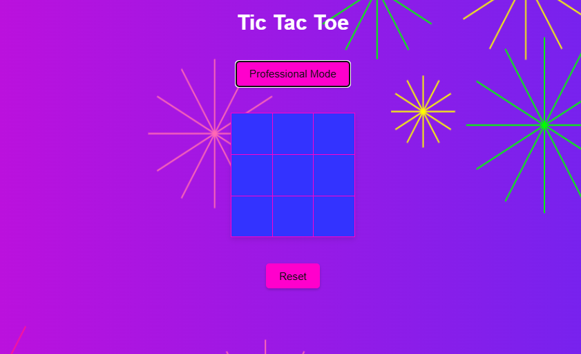
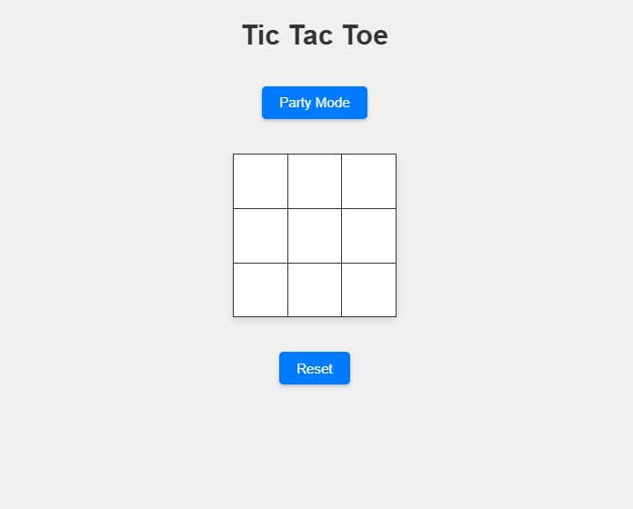
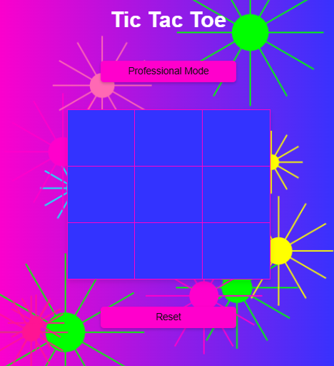

# Tic Tac Toe - Dynamic Web Application



## About
This Tic Tac Toe application is a dynamic web-based implementation of the classic game, featuring an interactive user interface and an exciting "Party Mode" to liven up your gameplay. It is a game where users can take turns to mark cells until there is a winner or the game ends in a draw. The game also includes a computer opponent for added challenge.

The "Party Mode" adds a techno vibe to the game with upbeat background music, a colorful gradient background, and dynamic fireworks effects to celebrate your victory in style!

## Features
- **Classic Tic Tac Toe Gameplay**: Enjoy the familiar 3x3 grid game.
- **Party Mode**: Enhance the gaming experience with techno music, a gradient background, and a celebratory fireworks effect.
- **Responsive Design**: Optimized for different screen sizes, so you can play anywhere.
- **Smooth Animations**: Transitions and hover effects make the interface visually appealing.

## Technologies Used
- **HTML5**: Markup for the structure of the app.
- **CSS3**: Styling for clean, modern visuals, with special effects in Party Mode.
- **JavaScript**: Adds functionality, logic for game mechanics, and animations.
- **Audio Integration**: Techno background music enhances the experience in Party Mode.

## Getting Started
### Prerequisites
- A web browser that supports HTML5, CSS3, and JavaScript.

### Installation
1. Clone the repository:
   ```bash
   git clone https://github.com/dustinmmoore/tic-tac-toe.git
   ```
2. Navigate to the project directory:
   ```bash
   cd tic-tac-toe
   ```
3. Open `index.html` in your browser:
   ```
   open index.html
   ```

## Usage
- Open the game in your browser.
- Click on any of the cells to make your move.
- Click on "Party Mode" to activate the fun and colorful version of the game.
- Play until you win, lose, or draw.
- Use the "Reset" button to start a new game.

## Author
- **Dustin Moore**
  - [LinkedIn](https://www.linkedin.com/in/dustinmmoore)
  - [GitHub](https://github.com/dustinmmoore)
  - [Website](https://dustinmoore.dev)

## Screenshots



## License
This project is licensed under the MIT License. See the [LICENSE](LICENSE) file for details.

## Acknowledgments
- **Bensound** for providing free music tracks: [https://www.bensound.com](https://www.bensound.com)
- Special thanks to everyone who has supported the development of this project.

## Future Improvements
- Add difficulty levels for the computer opponent.
- Improve visual effects in Party Mode.
- Implement multiplayer over the internet.

## Tags
- Web Developer
- Frontend Developer
- HTML5
- CSS3
- JavaScript
- Responsive Design
- Game Development
- UI/UX
- Interactive Web Applications

Enjoy the game, and have fun with Party Mode! 🎉

